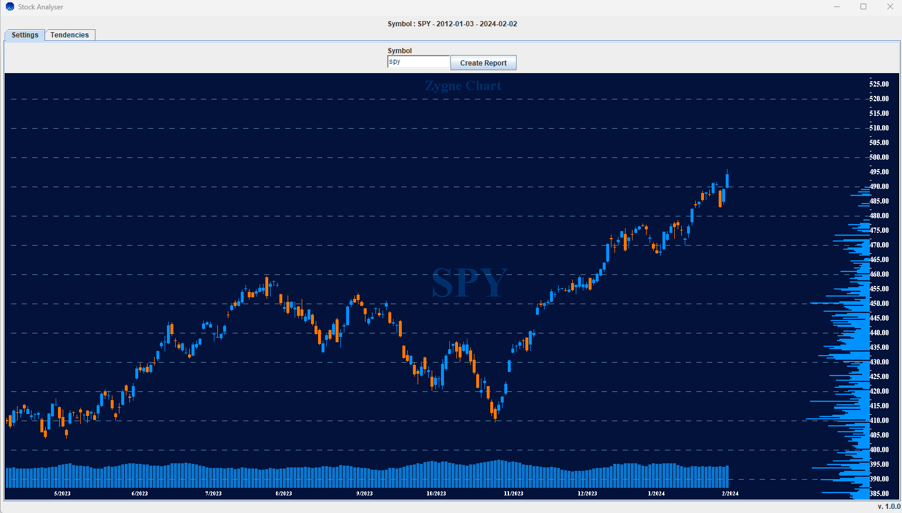
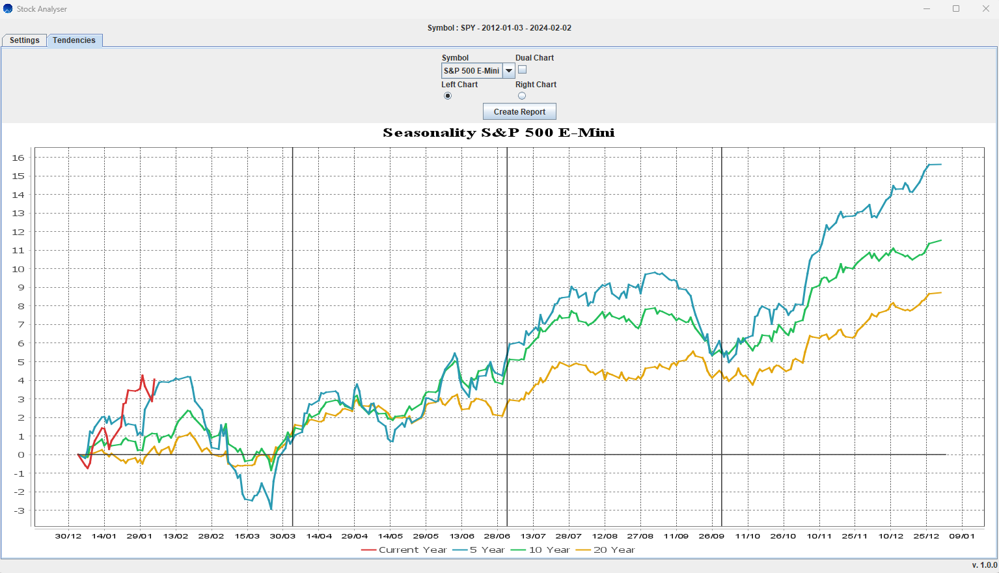

# MarketEye


### About
Project that fetches data from Alpha Vantage, and other data providers, and allows the user to visualize the price chart, and, see the seasonal tendency for a given market.

### This project supports these data providers
- [Polygon](https://polygon.io)
- [AlphaVantage](https://www.alphavantage.co/)
- [Cryptodatadownload](https://www.cryptodatadownload.com/)

### Features
- Bar chart with Volume Profile
- Line chart for seasonal tendencies

### Preview
#### Chart


#### Seasonality



### How to use
Locate the file ```api.properties``` add they api keys for `AlphaVantage` and `Polygon`, they both provide free API keys.
```
alpha_vantage_api=[ YOUR KEY FROM ALPHAVANTAGE GOES HERE ]
polygon_api=[ YOUR KEY FROM POLYGON GOES HERE ]
```
Data for Crypto currencies is from [Cryptodatadownload](https://www.cryptodatadownload.com/) which is free.


#### Adjusting Price Data
If the fetched price data does not include adjusted prices (such as those adjusted for stock splits or reverse splits), for example, when using the free version of AlphaVantage, there is an option to adjust the price data. This is done by analyzing price changes and comparing them with common split ratios (e.g., 1/10, 10/1, etc.). Please note that this algorithm may occasionally produce inaccurate results.