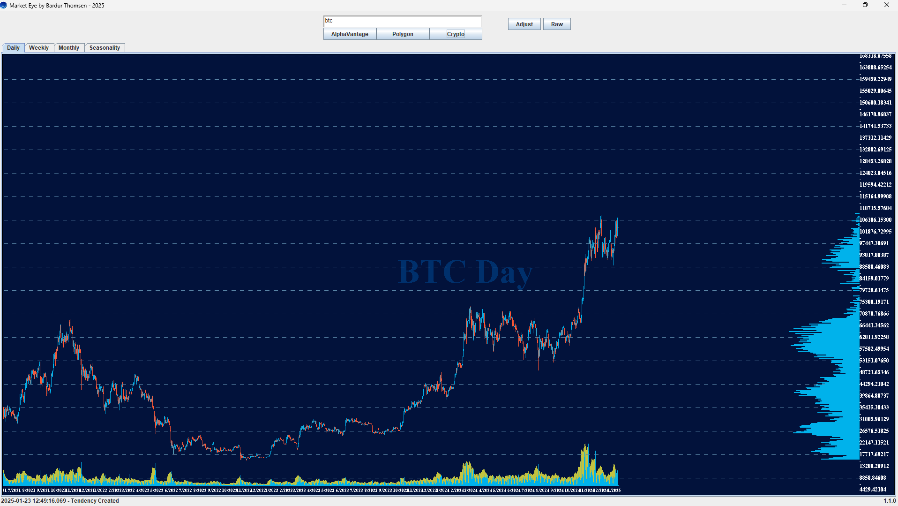

# MarketEye


### About
Project that fetches data from Alpha Vantage, and other data providers, and allows the user to visualize the price chart, and, see the seasonal tendency for a given market.

### Features
- Bar chart with Volume Profile
- Line chart for seasonal tendencies

### Preview
#### Chart


#### Seasonality


### How to use
Locate the file ```api.properties``` and change the value for `api` to the API key that you can get from https://www.alphavantage.co/ for free